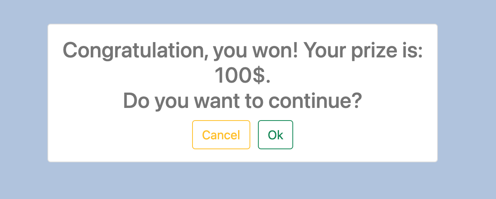

## Roulette game

A simple roulette game, where you can gain big winnings. The aim is to predict where the ball is going to land after spinnig the wheel.


## Installation and Setup Instructions
Clone down this repository. You will need node and npm installed globally on your machine.

Installation:  
```
npm install
```

To Start Server:  
```
npm start
```

To Visit App:  
```
localhost:3000/?#
```

## Reflection
The project was created to put my front-end development skills to test what I've learned up to this point. I used a mix of HTML, JavaScript, JSX, CSS, Bootstrap, and React to complete it. 

I wanted to build a simple roulette game that allowed a user to try his luck and win money. Originally, a player has 3 attempts to guess the number in a range between 0 and 8. The maximum prize decreases with each attempt. Later, I implemented the feature to continue the game after winning and to double the prize. 

I chose the `create-react-app` boilerplate to minimize the initial setup and invest more time into writing the code. 

Working on this project, I learned how to build out a user interface with stateful components and create stateful context providers to store state data in a single location. I used Hooks to enhance rendering performance and reflect the latest data. 

## How the app logic works
*Step 1:*
The window asks the user ‘Do you want to play a game?’. If the user clicks the 'Cancel' button, the message 'You did not become a billionaire, but could’ appears. 
 

 							
*Step 2:*
If the user clicks ‘Ok’ – the game starts: a user is asked to enter a number.	
-  User has 3 attempts to guess a number.
-  If the user guesses the number on the 1-st attempt, the prize is \$100 (maximum prize), on the 2-nd attempt – \$50, on the 3-rd attempt – \$25.
-  If the user did not guess a number, the window ‘Thank you for your participation. Your prize is: ... $’ is shown. 


*Step 3:*
-  If the user did guess – the message ‘Congratulation, you won! Your prize is... $. Do you want to continue?’ appears.



-  If the user does not want to continue – he can quit and take his money.
-  If the user does want to continue, the number range increases at 4 as the previous one (for example, [0; 8] -> [0; 12]), and the maximum prize becomes twice bigger (for example, on the 1-st attempt the prize is \$200, on the 2-nd attempt – \$100, on the 3-rd attempt – \$50). The prize is added to the previous one and the number of attempts is set to 3 (the user has 3 attempts to guess a number for each numbers range).


-  Each time user enters a number a range of cells is shown – how many attempts he has left, his total prize, and possible prize on the current attempt. 

 

– The wheel is turning for a few secs after each try. The number is shown in the center of the wheel if the user doesn`t guess.

 

*Steps are repeated until the user loses or decides to quit.*
